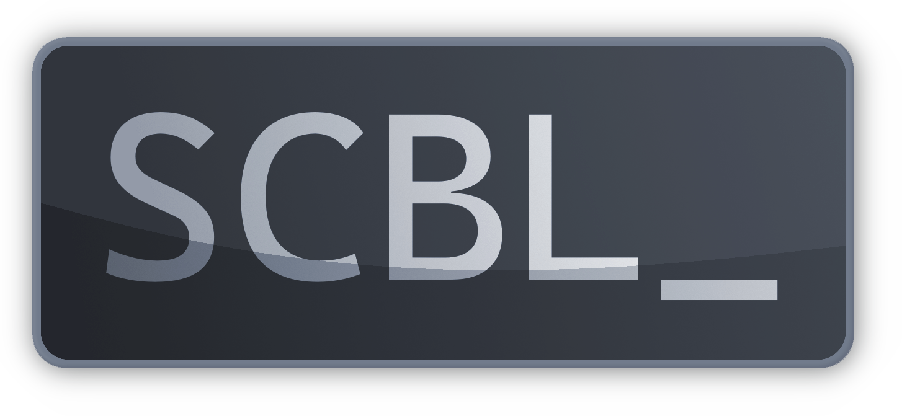

# SCBL
Simple Command Bar Language



A simple, small scripting language to be embedded with a C++ program.
It is constructed of functions and parameters:
```
<function> <parameters>;
```
The parameters are 1 byte big integers, but SCBL offers strings and constants which are turned into integers in the parser.

#### Strings
Strings start and end with `"`. The parser turns the characters into separate integer parameters by their ascii codes and automatically puts a NULL Terminator after each string as an integer parameter, but if you put `~` after the string, it wont do so. Example using the SCBL Shell:
```lua
printr "A";
printr "A"~;
```
First `printr` would output `650` (As a combination of `A` (65) and the NULL Terminator (0)) and the second one would output `65`.

#### Integers
In SCBL, integers cannot have a negative value and by default take up 4 bytes, but you can change it to 1 or 2 bytes by putting `:` right after the integer and then the amount of bytes for it to take up (1, 2, 4). Example using the SCBL Shell:

```lua
print "Hello, World!"~ 10:1 0;
```
This will turn 10 into a 1 byte big integer, outputting `Hello, World!` and jumping to the next line.

#### Comments
One line comments start with a `#`, multi line comments start with `{` and end with `}`. Example:
```
# This is a one line comment!

{
    Hi!
    This is a multi line comment!
}
```

## Compiling and running the shell
#### Linux
Run `compile` as bash in the terminal:
```sh
bash compile
```
then run scbl:
```sh
scbl
```
#### Windows
First make sure you have g++ installed (Command Prompt will not recognize the `g++` command if you dont) and run the following commands:
```bat
mkdir bin
g++ -g shell/main.cc -o bin/scbl -O3 -s -Wall -std=c++17;
```
then run scbl:
```bat
scbl
```

## Embedding with C++
SCBL is really small and simple, so you only need to include the header file `scbl.hh` in your C++ program and then create an object of SCBL_Interpreter class which, as everything else SCBL-related, can be found inside the SCBL namespace. List of SCBL_Interpreter methods:
- `void AddFunction(Function)`: Pushes the function to the functions stack
- `void SetFunction(Function)`: Rewrites, or if not found, pushes the function to the functions stack
- `void AddConstant(Constant)`: Pushes the constant to the constants stack
- `void SetConstant(Constant)`: Rewrites, or if not found, pushes the constant to the constants stack
- `int8_t Parse(std::string Text)`: Parses the text into tokens, returns `SCBL_PARSER_OK` (0) if no errors occured, else returns `SCBL_PARSER_ERROR` (1)
- `int8_t Run()`: Interprets the parsed text, returns `SCBL_RUNTIME_OK` (0) if no errors occured, else returns `SCBL_RUNTIME_ERROR` (1)
- `std::string GetErrorMsg()`: Returns the description of the last error

`Function` and `Constant` are two other classes inside the SCBL namespace. `Function` holds the Name (std::string) and Callback (`void (*callback)(std::vector <uint32_t>)`), `Constant` holds the Name (`std::string`), Bytes (`std::vector <uint8_t>`) and size (`uint8_t`). `Function` and `Constant` constructors:
- `Function(std::string Name, callback Callback)`
- `Constant(std::string Name, uint32_t Value, uint8_t Size)`

`Size` is the amount of bytes to give to the value (1, 2, 4).
`callback` is a function which takes two parameters, `std::vector <uint8_t>` which are the parameters passed to the SCBL function and `void*` which is the user data.

#### Example:
```cc
#include <iostream>
#include "scbl.hh"

int main() {
    SCBL::SCBL_Interpreter SCBLi;
    
    SCBLi.AddConstant(SCBL::Constant("newline", 10, SCBL_CONSTANT_1BYTE));
    SCBLi.AddFunction(SCBL::Function("print", [] (std::vector <uint8_t> Parameters, void* _) {
        for (uint32_t i = 0; i < (uint32_t)Parameters.size(); ++ i) 
            std::cout << (char)Parameters[i];
    }));
    
    if (SCBLi.Parse("print \"Hello, World!\"~ newline;") == SCBL_PARSER_ERROR) {
        std::cout << SCBLi.GetErrorMsg() << std::endl;
        
        return 0;
    };
    
    if (SCBLi.Run() == SCBL_RUNTIME_ERROR) {
        std::cout << SCBLi.GetErrorMsg() << std::endl;
        
        return 0;
    };
    
    return 0;
};
```
SCBL Code: `print "Hello, World!"~ newline;`
Output: `Hello, World!`

If you want to make parameter checking easier, you can use the `ParameterHandler` class in SCBL namespace.
Constructor: `ParameterHandler(std::vector <uint8_t> Parameters)`
Methods:
- `uint8_t GetNextParam8()`: Gets the next 1 byte
- `uint16_t GetNextParam16()`: Gets the next 2 bytes and puts them into one 16bit integer
- `uint32_t GetNextParam32()`: Gets the next 4 bytes and puts them into one 32bit integer
- `uint32_t GetNextParamInt()`: Tries getting the next 4 bytes but gets less if there is not enough parameters
- `std::string GetNextParamStr()`: Gets a string (Stops at a NULL Terminator (`0`))
- `bool IsOutOfParams()`: Checks if the counter reached the end
- `void ResetCounter()`: Resets the counter

If any of the GetNext methods run out of parameters without ending succesfully, they set `OutOfParams` to `true` and return `0`. Example:
```cc
#include <iostream>
#include <fstream>
#include "scbl.hh"

int main() {
    SCBL::SCBL_Interpreter SCBLi;
    
    SCBLi.AddFunction(SCBL::Function("writefile", [] (std::vector <uint8_t> Parameters, void* _) {
        SCBL::ParameterHandler phnd(Parameters);
	    
	    std::string filename = phnd.GetNextParamStr();
	    std::string filecontents = phnd.GetNextParamStr();
	    
	    std::ofstream fhnd(filename);
        fhnd << filecontents;
    }));
    
    if (SCBLi.Parse("writefile \"File.txt\" \"Hello!\"~ 10:1 \"This is my file :)\"") == SCBL_PARSER_ERROR) {
        std::cout << SCBLi.GetErrorMsg() << std::endl;
        
        return 0;
    };
    
    if (SCBLi.Run() == SCBL_RUNTIME_ERROR) {
        std::cout << SCBLi.GetErrorMsg() << std::endl;
        
        return 0;
    };
    
    return 0;
};
```
SCBL Code: `writefile "File.txt" "Hello!"~ 10:1 "This is my file :)"`
Output: File `File.txt` with contents 
```
Hello!
This is my file :)
```
